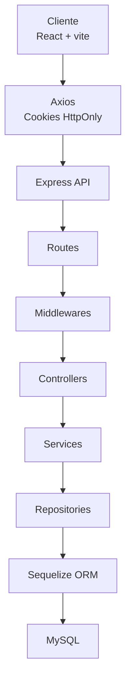

# Arquitectura General

```mermaid
flowchart TB
A["Cliente <br/> React + vite"] --> B["Axios <br/> Cookies HttpOnly"]
B --> C["Express API"] 
C --> D["Routes"] 
D --> E["Middlewares"] 
E --> F["Controllers"]
F --> G["Services"]
G --> H["Repositories"]
H --> I["Sequelize ORM"]
I --> J["MySQL"]
```