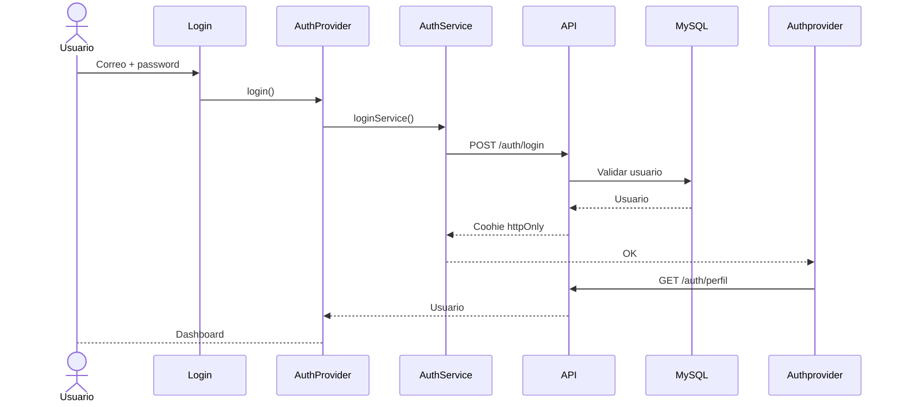

# Arquitectura Flujo - Login

```mermaid
sequenceDiagram
    actor Usuario
    participant Login
    participant AuthProvider
    participant AuthService
    participant API
    participant MySQL
    Usuario->>Login: Correo + password
    Login->>AuthProvider: login()
    AuthProvider->>AuthService: loginService()
    AuthService->>API: POST /auth/login
    API->>MySQL: Validar usuario
    MySQL-->>API: Usuario
    API-->>AuthService:Coohie httpOnly
    AuthService-->>Authprovider: OK
    Authprovider->>API: GET /auth/perfil
    API-->>AuthProvider: Usuario
    AuthProvider-->Usuario: Dashboard
```